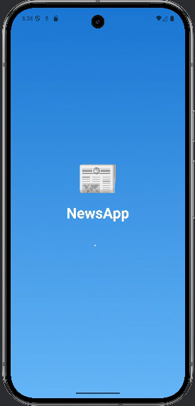

# 📰 The News - Jetpack Compose News Application


A modern and responsive News Application built using **Jetpack Compose** and **MVVM architecture**. This application fetches and displays real-time news headlines with rich visuals and smooth user interactions. Designed with clean separation of concerns, it offers robust error handling, smooth loading animations and a delightful UX.

---

| ✨ Features | 🧠 Tech Stack | 🔮 Possible Improvements |
|------------|---------------|--------------------------|
| - 🧭 Follow MVVM architecture  <br> - 🌐 Fetches live news via Retrofit  <br> - 🧱 Jetpack Compose + Material 3  <br> - 🌀 Animated bouncing dots loader  <br> - ⏱️ Minimum 2s loading screen  <br> - 📰 Clickable news cards open articles in browser  <br> - 📶 Handles no/slow internet  <br> - 💬 Dialog for invalid links  <br> - 🧊 Emoji splash screen | - Kotlin  <br> - Jetpack Compose  <br> - Material 3  <br> - MVVM Architecture  <br> - Retrofit  <br> - Coroutines + StateFlow | - 🔍 Add search functionality  <br> - 📰 Filter by category (Sports, Tech, etc.)  <br> - 🌓 Dark mode toggle  <br> - ⏬ Pull-to-refresh  <br> - 🌍 Localization (multi-language)  <br> - 📊 Analytics tracking |

---

## 📸 Screenshots

| Splash Screen         | Home Screen            | Error Dialog             |
|-----------------------|------------------------|---------------------------|
|  |  |  |

---

## 🤝 Contributing

We welcome all contributions to improve this project ! 💡  
Whether it's fixing bugs, improving documentation or proposing new features — your help is appreciated.

> ### 📦 How to Contribute
>
> ```bash
> 1. Fork the repository
> 2. Create a new branch
>    git checkout -b feature/my-new-feature
>
> 3. Make your changes and commit
>    git commit -m "Add: my new feature"
>
> 4. Push your branch to GitHub
>    git push origin feature/my-new-feature
>
> 5. Create a Pull Request from your fork
> ```
>
> 💬 Once submitted, your PR will be reviewed. Let's build something awesome together!

---

## 👤 Author

**Suman Mula**

- 🔗 [GitHub](https://github.com/Sumanmula)  
- 📧 sumanmula2000@gmail.com 
- 💼 Android Developer | Kotlin | Jetpack Compose Enthusiast

---

## 📦 Download APK

👇 **Click here to download the latest APK**

[](https://surl.lu/raputm)

> 📱 You can install this APK on any Android device (Android 5.0 and above).  
> ⚠️ Allow installation from unknown sources to install the app manually.

---

## 📜 License

This project is licensed under the **MIT License**.  
See the [LICENSE](LICENSE) file for more information.
